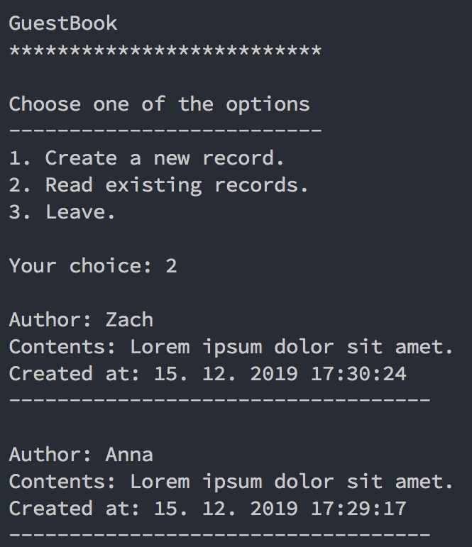

# GuestBook

A simple user logging application.



---

## Setup

*Assuming you have PHP (7+) and Composer installed system-wide.*

1. Clone or download repository
  
    ```bash
    git clone https://github.com/ilya-zhidkov/guestbook.git
    ```

2. Install necessary dependencies

    ```bash
    composer install
    ```

3. Run application
   
    ```bash
    php index.php
    ```

---

### Use case

- Setting up a new **PHP** project
- Following a pre-described UML diagram
- Using **Object-Oriented** approach

---

#### Nice to have features

  - [x] PSR - 4 auto-loading
  - [x] Sorting data 

---

*Made for students of UJEP (Univerzita Jana Evangelisty Purkyně) in Ústí nad Labem who are specializing in computer science degree.*
